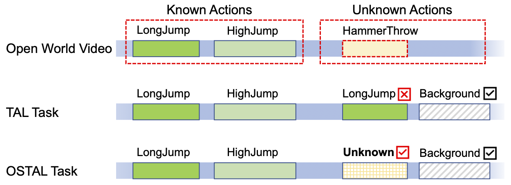

# OpenTAL: Towards Open Set Temporal Action Localization
[Project]() **|** [Paper & Supp]() **|** [Presentation]()

[Wentao Bao](https://cogito2012.github.io/homepage), 
[Qi Yu](https://www.rit.edu/mining/qi-yu), 
[Yu Kong](https://people.rit.edu/yukics/)

This is an official PyTorch implementation of OpenTAL, published in IEEE/CVF Conference on Computer Vision and Pattern Recognition (**CVPR**), 2022.


## Open Set Temporal Action Localization (**OSTAL**) Task

The OSTAL task is different from the TAL in that, there exist unknown actions in untrimmed videos and the OSTAL models need to reject the positively localized action as the unknown, rather than falsely assign it to a known class such as the `LongJump` or the non-informative `Background` class.

<p align="center">

</p>

## OpenTAL Method
In this work, we, for the first time, step toward the Open Set TAL (OSTAL) problem and propose a general framework **OpenTAL** based on Evidential Deep Learning (EDL). Specifically, the OpenTAL consists of uncertainty-aware action classification, actionness prediction, and temporal location regression. With the proposed importance-balanced EDL method, classification uncertainty is learned by collecting categorical evidence majorly from important samples. To distinguish the unknown actions from background video frames, the actionness is learned by the positive-unlabeled learning. The classification uncertainty is further calibrated by leveraging the guidance from the temporal localization quality. The OpenTAL is general to enable existing TAL models for open set scenarios, and experimental results on THUMOS14 and ActivityNet1.3 benchmarks show the effectiveness of our method. 

The following figure shows an overview of our proposed OpenTAL method. 


## Updates
- (March, 2021) We released OpenTAL training and inference code.
- (March, 2022) OpenTAL is accepted by CVPR2021.

## Getting Started

This repo is developed mainly referring the [AFSD (CVPR 2021)](https://github.com/TencentYoutuResearch/ActionDetection-AFSD) from Tencent YouTu Research. Most installations and data preparation steps are kept unchanged.
### Environment
- Python 3.7
- PyTorch == 1.9.0
- NVIDIA GPU

### Setup
```shell script
# create conda virtual environment
conda create -n opental python=3.7 

# install pytorch and cudatoolkit (take pytorch 1.9 as an example)
conda install pytorch=1.9.0 torchvision=0.10.0 torchtext cudatoolkit-dev -c pytorch -c conda-forge

# install other python libs.
pip install -r requirements.txt

# compile the C++/CU files from AFSD
python setup.py develop
```

# **The followings will be updated!**

### Data Preparation
- **THUMOS14 RGB data:**
1. Download pre-processed RGB npy data (13.7GB): [\[Weiyun\]](https://share.weiyun.com/bP62lmHj)
2. Unzip the RGB npy data to `./datasets/thumos14/validation_npy/` and `./datasets/thumos14/test_npy/`


### Inference
We provide the pretrained models contain I3D backbone model and final RGB and flow models for THUMOS14 dataset:
[\[Google Drive\]](https://drive.google.com/drive/folders/1IG51-hMHVsmYpRb_53C85ISkpiAHfeVg?usp=sharing),
[\[Weiyun\]](https://share.weiyun.com/ImV5WYil)
```shell script
# run RGB model
python3 AFSD/thumos14/test.py configs/thumos14.yaml --checkpoint_path=models/thumos14/checkpoint-15.ckpt --output_json=thumos14_rgb.json

# run flow model
python3 AFSD/thumos14/test.py configs/thumos14_flow.yaml --checkpoint_path=models/thumos14_flow/checkpoint-16.ckpt --output_json=thumos14_flow.json

# run fusion (RGB + flow) model
python3 AFSD/thumos14/test.py configs/thumos14.yaml --fusion --output_json=thumos14_fusion.json
```

### Evaluation
The output json results of pretrained model can be downloaded from: [\[Google Drive\]](https://drive.google.com/drive/folders/10VCWQi1uXNNpDKNaTVnn7vSD9YVAp8ut?usp=sharing),
[\[Weiyun\]](https://share.weiyun.com/R7RXuFFW)
```shell script
# evaluate THUMOS14 fusion result as example
python3 AFSD/thumos14/eval.py output/thumos14_fusion.json

mAP at tIoU 0.3 is 0.6728296149479254
mAP at tIoU 0.4 is 0.6242590551201842
mAP at tIoU 0.5 is 0.5546668739091394
mAP at tIoU 0.6 is 0.4374840824921885
mAP at tIoU 0.7 is 0.3110112542745055
```

### Training
```shell script
# train the RGB model
python3 AFSD/thumos14/train.py configs/thumos14.yaml --lw=10 --cw=1 --piou=0.5

# train the flow model
python3 AFSD/thumos14/train.py configs/thumos14_flow.yaml --lw=10 --cw=1 --piou=0.5
```
### 

## Citation
If you find this project useful for your research, please use the following BibTeX entry.
```
@InProceedings{Lin_2021_CVPR,
    author    = {Lin, Chuming and Xu, Chengming and Luo, Donghao and Wang, Yabiao and Tai, Ying and Wang, Chengjie and Li, Jilin and Huang, Feiyue and Fu, Yanwei},
    title     = {Learning Salient Boundary Feature for Anchor-free Temporal Action Localization},
    booktitle = {Proceedings of the IEEE/CVF Conference on Computer Vision and Pattern Recognition (CVPR)},
    month     = {June},
    year      = {2021},
    pages     = {3320-3329}
}
```
